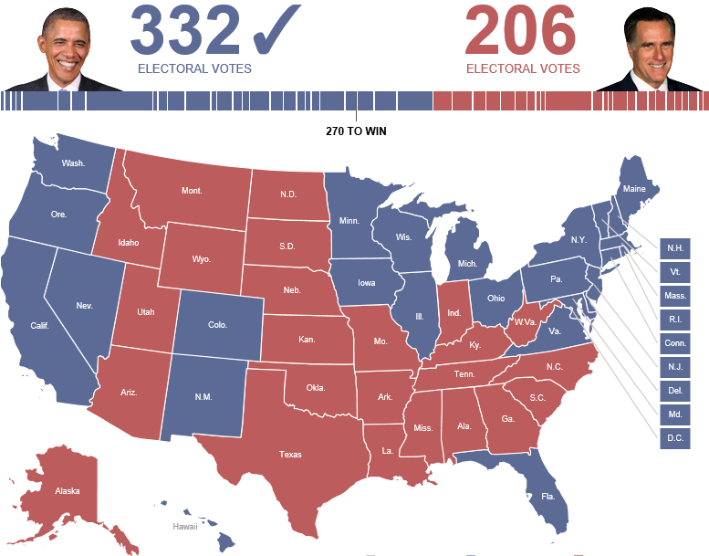
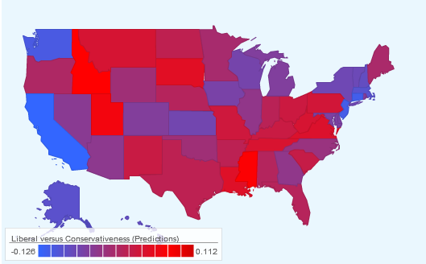

## About Me

I am a Senior Research Scientist at Alibaba DAMO Academy in Seattle, USA, leading a team towards deep understanding of the semantics of the natural language. Before joining Alibaba in 2018, I have been a Senior Research SDE at Microsoft Research Redmond, USA, since 2015. I received my Ph.D. degree from the Computer Science Department at University of California, Los Angeles (UCLA) in 2015.

My research interests include natural language processing, text mining, information retrieval, and machine learning. I am currently working on various NLP problems, models, algorithms and techniques, including:\\
◎ Pre-training of deep learning models for natural language understanding and generation\\
◎ Machine reading comprehension\\
◎ Open-domain question answering\\
◎ Natural language generation\\
◎ Deep learning NLP for text retrieval, search, and recommendation

---

## Publications

* **Bin Bi**, Chen Wu, Ming Yan, Wei Wang, Jiangnan Xia, and Chenliang Li. *Generating Well-formed Answers by Machine Reading with Stochastic Selector Networks*. Proceedings of the 34th AAAI Conference on Artificial Intelligence (**AAAI**), 2020.
* Wei Wang, **Bin Bi**, Ming Yan, Chen Wu, Zuyi Bao, Jiangnan Xia, Liwei Peng, and Luo Si. *StructBERT: Incorporating Language Structures into Pre-training for Deep Language Understanding*. Proceedings of the 8th International Conference on Learning Representations (**ICLR**), 2020. (**Rank 1 @ [GLUE Leaderboard](https://gluebenchmark.com/leaderboard)**)
* **Bin Bi**, Chen Wu, Ming Yan, Wei Wang, Jiangnan Xia, Chenliang Li. *Incorporating External Knowledge into Machine Reading for Generative Question Answering*. Proceedings of the 2019 Conference on Empirical Methods in Natural Language Processing and the 9th International Joint Conference on Natural Language Processing (**EMNLP**), 2019.
* Ming Yan, Jiangnan Xia, Chen Wu, **Bin Bi**, Zhongzhou Zhao, Ji Zhang, Luo Si, Rui Wang, Wei Wang, and Haiqing Chen. *A Deep Cascade Model for Multi-Document Reading Comprehension*. Proceedings of the 33rd AAAI Conference on Artificial Intelligence (**AAAI**), 2019.
* **Bin Bi**, and Junghoo Cho. *Modeling a Retweet Network via an Adaptive Bayesian Approach*. Proceedings of the 25th International World Wide Web Conference (**WWW**), 2016.
* **Bin Bi**, Hao Ma, Paul Hsu, Wei Chu, Kuansan Wang, and Junghoo Cho. *Learning to Recommend Related Entities to Search Users*. Proceedings of the 8th ACM International Conference on Web Search and Data Mining (**WSDM**), 2015.
* Youngchul Cha, Keng-hao Chang, Hari Bommaganti, Ye Chen, Tak Yan, **Bin Bi**, and Junghoo Cho. *A Universal Topic Framework (UniZ) and Its Application in Online Search*. Proceedings of the 30th ACM SIGAPP Symposium On Applied Computing (**SAC**), 2015.
* **Bin Bi**, Yuanyuan Tian, Yannis Sismanis, Andrey Balmin, and Junghoo Cho. *Scalable Topic-Specific Influence Analysis on Microblogs*. Proceedings of the 7th ACM International Conference on Web Search and Data Mining (**WSDM**), 2014.
* **Bin Bi**, Ben Kao, Chang Wan, and Junghoo Cho. *Who Are Experts Specializing in Landscape Photography? - Analyzing Topic-specific Authority on Content Sharing Services*. Proceedings of the 20th ACM SIGKDD Conference on Knowledge Discovery and Data Mining (**KDD**), 2014.
* **Bin Bi**, Milad Shokouhi, Michal Kosinski, and Thore Graepel. *Inferring the Demographics of Search Users - Social Data Meets Search Queries*. Proceedings of the 22nd International World Wide Web Conference (**WWW**), 2013.
* **Bin Bi**, and Junghoo Cho. *Automatically Generating Descriptions for Resources by Tag Modeling*. Proceedings of the 22nd ACM International Conference on Information and Knowledge Management (**CIKM**), 2013.
* Youngchul Cha, **Bin Bi**, Chu-Cheng Hsieh, and Junghoo Cho. *Incorporating Popularity in Topic Models for Social Network Analysis*. Proceedings of the 36th International ACM SIGIR Conference (**SIGIR**), 2013 (**Best Paper Runner Up**).
* Ruirui Li, Ben Kao, **Bin Bi**, Reynold Cheng, and Eric Lo. *DQR: A Probabilistic Approach to Diversified Query Recommendation*. Proceedings of the 21st ACM International Conference on Information and Knowledge Management (**CIKM**), 2012.
* **Bin Bi**, Sau Dan Lee, Ben Kao, and Reynold Cheng. *CubeLSI: An Effective and Efficient Method for Searching Resources in Social Tagging Systems*. Proceedings of the 27th IEEE International Conference on Data Engineering (**ICDE**), 2011.
* **Bin Bi**, Lifeng Shang, and Ben Kao. *Collaborative Resource Discovery in Social Tagging Systems*. Proceedings of the 18th ACM International Conference on Information and Knowledge Management (**CIKM**), 2009.

---

## Academic Achievements

I have been working with my team to advance the state-of-the-art in the premier academic competitions/benchmarks in NLP:

**Rank** | **Solution** | **Competition/Benchmark**
\#1 | PALM & BayesQA | [MARCO](http://www.msmarco.org/leaders.aspx) ([Announcement](https://twitter.com/MSMarcoAI/status/1007324430123450369))
\#1 | StructBERT | [GLUE](https://gluebenchmark.com/leaderboard)
\#2 | RoBERTa + KE | [CommonsenseQA](https://www.tau-nlp.org/csqa-leaderboard)
\#1 | SLQA+ | [SQuAD v1.1](https://rajpurkar.github.io/SQuAD-explorer) (as of 11/1/2018)
\#1 | AliReader | [DuReader](https://ai.baidu.com/broad/leaderboard?dataset=dureader)

---

## Research Internships

Microsoft Research Redmond, WA | Ad Click Prediction, Knowledge Graph Mining | 12/2012 - 3/2013, 6/2013 - 9/2013
Microsoft Research Cambridge, UK | Machine Learning, Social Network Analysis | 10/2012 - 12/2012
IBM Research Almaden, CA | Large-scale Data Mining, Social Media Analysis | 7/2012 - 9/2012
Microsoft Research Asia | Image Retrieval, Computer Vision | 11/2007 - 6/2008

---

## Patents

**Identifying Influencers for Topics in Social Media**
* Inventors: Bin Bi, Andrey Balmin, John Sismanis, and Yuanyuan Tian
* Patent Numbers: US9449096B2, US9864807B2

---

## Media Coverage

[Inferring the Demographics of Search Users - Social Data Meets Search Queries](http://www2013.w3c.br/proceedings/p131.pdf) by **Bin Bi**, Milad Shokouhi, Michal Kosinski, and Thore Graepel, Proceedings of ACM International Conference on World Wide Web (**WWW**), 2013.
* [Facebook knows your sexuality, race and religion through ‘likes’](https://www.ibtimes.co.uk/facebook-button-provides-information-sexuality-personality-race-444785), **International Business Times**, 2013.
* ['Like' curly fries on Facebook? Then you're clever](https://www.telegraph.co.uk/technology/facebook/9923070/Like-curly-fries-on-Facebook-Then-youre-clever.html), **The Telegraph**, 2013.
* [How Facebook 'likes' can reveal clues to your sexuality, political beliefs and religion](https://www.dailymail.co.uk/sciencetech/article-2291749/How-Facebook-likes-reveal-clues-sexuality-political-beliefs-religion.html), **Daily Mail**, 2013.
* [Facebook 'likes' can reveal your secrets, study finds](https://www.cnn.com/2013/03/11/tech/social-media/facebook-likes-study/index.html), **CNN**, 2013.
* [Facebook 'likes' used to predict personality traits, social preferences](https://www.eweek.com/cloud/facebook-likes-used-to-predict-personality-traits-social-preferences), **eWEEK**, 2013.

---

## Selected Talks & Presentations

*Open-domain Question Answering with Machine Reading Comprehension* | Microsoft Research, 7/2017
*Detecting and Typing Entities via CRF and Deep Neural Networks* | Microsoft Research, 5/2016
*Modeling a Retweet Network via an Adaptive Bayesian Approach* | WWW, 4/2016
*Learning to Recommend Related Entities to Search Users* | WSDM, 2/2015
*Bayesian Modeling for Analyzing Online Content and Users* | Yahoo Labs, 1/2015
*Learning to Discover High-quality Information for Web Users* | Symantec Research Labs, 8/2014
*Analyzing Topic-specific Authority on Content Sharing Services* | KDD, 8/2014
*Inferring the Demographics of Search Users - Social Data Meets Search Queries* | WWW, 5/2013
*Automatically Generating Descriptions for Resources by Tag Modeling* | CIKM, 10/2013
*Scalable Topic-Specific Influence Analysis on Microblogs* | IBM Almaden Research Center, 9/2012
*An Effective and Efficient Method for Searching Resources in Social Tagging Systems* | ICDE, 4/2011
*Collaborative Resource Discovery in Social Tagging Systems* | CIKM, 11/2009
{: .talk-table }
